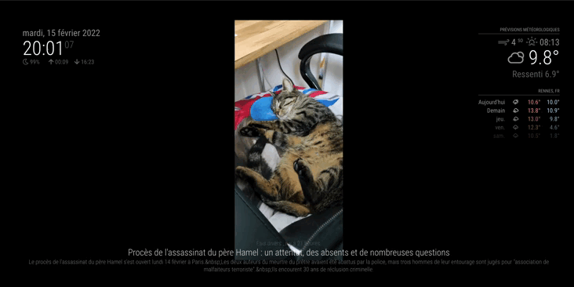

# MagicMirror2 Module: MMM-FTP-image

```sh

  __  __ __  __ __  __        ______ _______ _____        _
 |  \/  |  \/  |  \/  |      |  ____|__   __|  __ \      (_)
 | \  / | \  / | \  / |______| |__     | |  | |__) |_____ _ _ __ ___   __ _  __ _  ___
 | |\/| | |\/| | |\/| |______|  __|    | |  |  ___/______| | '_ ` _ \ / _` |/ _` |/ _ \
 | |  | | |  | | |  | |      | |       | |  | |          | | | | | | | (_| | (_| |  __/
 |_|  |_|_|  |_|_|  |_|      |_|       |_|  |_|          |_|_| |_| |_|\__,_|\__, |\___|
                                                                             __/ |
                                                                            |___/
```

## Description

A [MagicMirror](https://magicmirror.builders/) Module to display images from an FTP server on the Mirror.

Image authorized : GIF, PNG, JPG, JPEG, BMP, WEBP, ICO, DIB

## Screenshots

Displaying images from FTP server



## Installation

Open your terminal in your MagicMirror project and ⤵️

1. Go to your MagicMirror's **module folder**:

```sh
$ cd ~/MagicMirror/modules
```

2. Clone this module

```sh
$ git clone https://github.com/jboucly/MMM-FTP-image.git
```

3. Go to directory of this module

```sh
$ cd MMM-FTP-image
```

4. Install dependencies

```sh
$ npm ci
```

5. Configure the module in the `config.js` file.

## Configurations

To use this module, add it to the modules array in the `config/config.js` file:

```javascript
modules: [
  {
    module: "MMM-FTP-image",
    position: "middle_center",
    config: {
      opacity: 1.0,
      width: "20%",
      height: "20%",
      dirPath: "/magicMirror",
      password: "1234567890",
    },
  },
];
```

## Configuration options

The following properties can be configured:
| Options | Required | Default | Description |
|-----------------------|:--------:|:---------:|----------------------------------------|
| host | false | localhost | Host of your FTP server. Required if the ftp hostname is **not** 'localhost' |
| port | false | 21 | Port of your FTP server. Required if the ftp port is **not** '21' |
| user | false | pi | Name of user for connect to FTP server. Required if the ftp user is **not** 'pi' |
| password | true | null | Password for connect to FTP server.|
| --------------------- | -------- | --------- | -------------------------------------- |
| opacity | false | 1.0 | Image opacity style |
| width | false | 100% | Image width |
| height | false | 100% | Image height |
| --------------------- | -------- | --------- | -------------------------------------- |
| imgChangeInterval | false | 10s | Image change interval |
| imageLoadInitialDelay | false | 1s | Initial delay for show first image |
